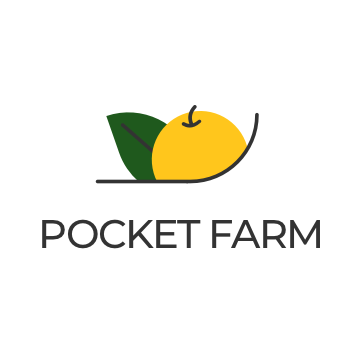
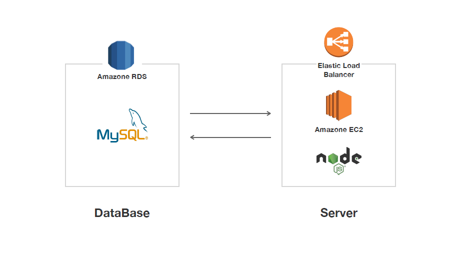

# POCKETFARM_Server

### Pocket Farm - 포켓팜
예약제로 신선하게, 내 손안의 착한 농장 Pocket Farm의 Server 저장소입니다.

***


## Pocket Farm Project Repositories

* [Android](https://github.com/TEAM-POCKETFARM/PocketFarm)

Android Studio Client

* [Server](https://github.com/TEAM-POCKETFARM/POCKETFARM_Server/)

Node.js API SERVER


### REST API WIKI 
***
[REST API 문서](https://github.com/TEAM-POCKETFARM/POCKETFARM_Server/wiki)

### Architecture
***



### ERD
***

.PNG)

### 핵심 기능 
***
* 예약 기능

주문받은 만큼 생산할 수 있도록 원하는 양의 농산물을 예약하는 기능
* 제작 과정 확인 기능

농부들이 재배하는 과정을 사진 및 글로 소비자들에게 투명하게 알려줘서 농산물에 대한 신뢰도를 높일 수 있는 기능 
* 착한 소비

소비자가 구매한 금액에 대한 포인트를 제공하여 코로나19 피해 농가에 기부 현황을 보여주는 기능 


### Dependency Module
***
```
"dependencies": {
    "cookie-parser": "~1.4.4",
    "debug": "~2.6.9",
    "express": "~4.16.1",
    "http-errors": "~1.6.3",
    "jade": "~1.11.0",
    "morgan": "~1.9.1",
    "promise-mysql": "^4.1.3"
  }
```

### Pocket Farmer 팀원들 👨‍👧‍👧
* 이동원 - 기획자
* 박종연 - 기획자
* 채지혜 - 디자이너
* 서창우 - 프론트 개발자
* 조하담 - 백엔드 개발자
